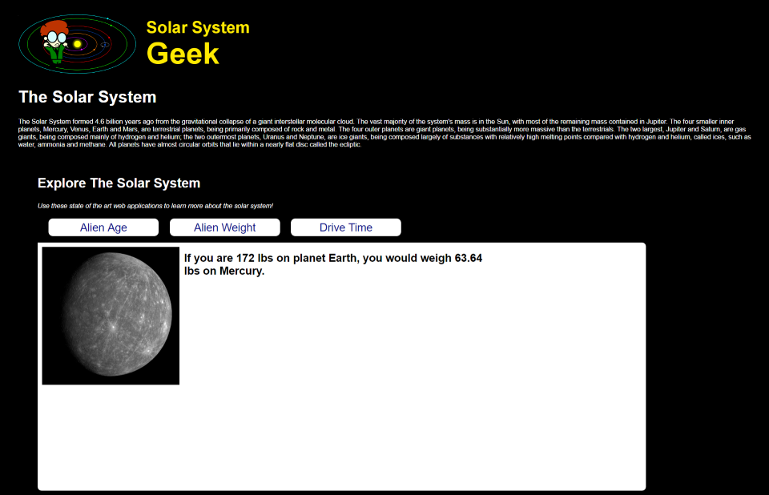
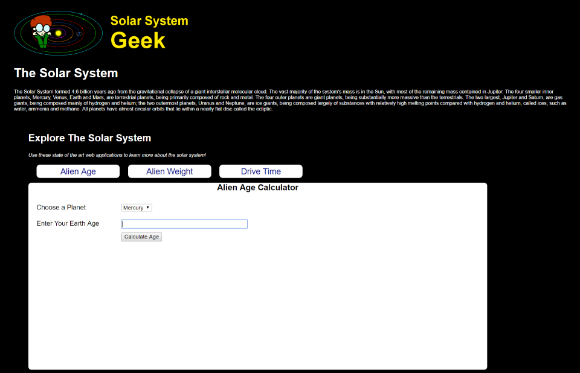
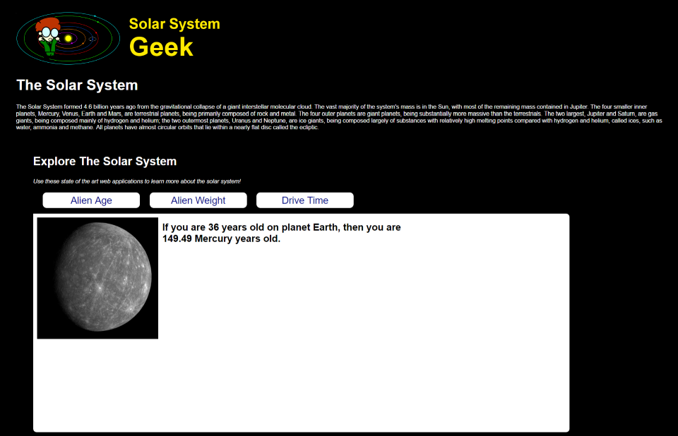
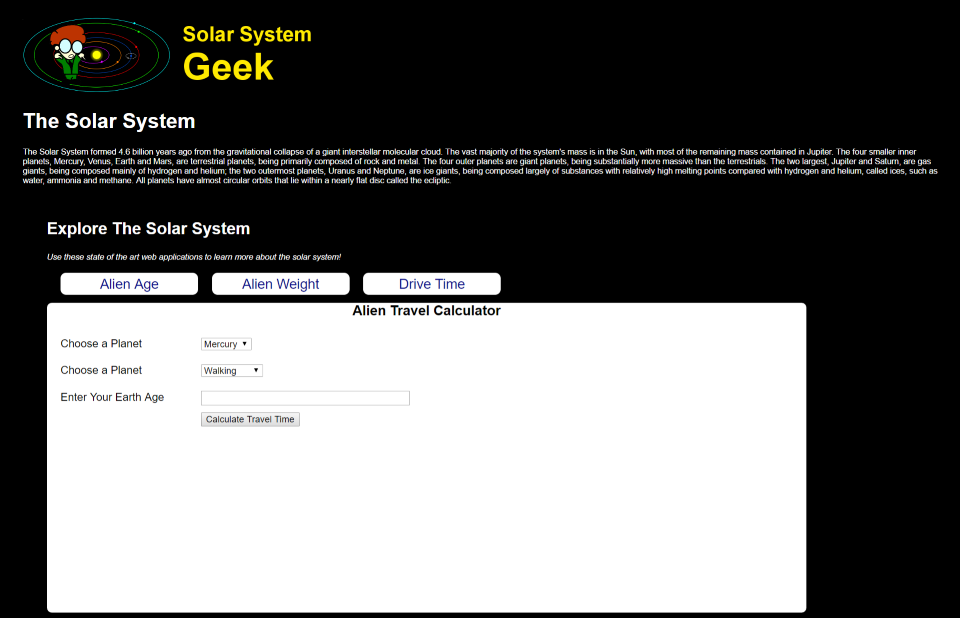
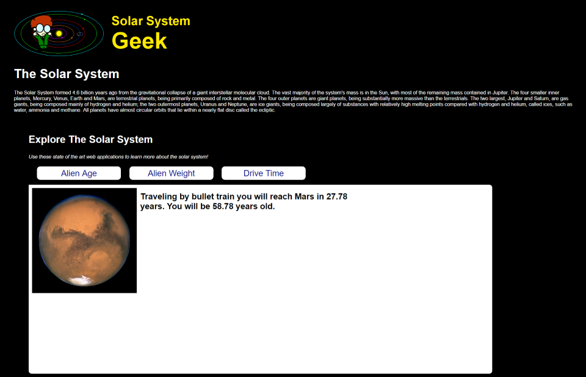

# MVC Controllers - Pair Exercise

# Day 1 - Monday - Solar System Geek Calculators
On the Solar System Geek home page there are links for three different calculation tools to "Explore the Solar System". Implement these three calculators as specified below and modify the home page links to point to your implementations.

## 1. Alien Weight Calculator
Given a weight on earth, this calculator should compute the equivalent weight on another planet in the solar system.  Use the [gravity of the alien planet](http://www.aerospaceweb.org/question/astronomy/q0227.shtml) compared to earth gravity to calculate the alien weight.
### Input

### Output

## 2. Alien Age Calculator
Given an age in Earth years, this calculator should compute the equivalent age in [years for another planet in the solar system](http://www.enchantedlearning.com/subjects/astronomy/age.shtml).

### Input

### Output

## 3. Alien Travel Calculator
Given a destination planet, mode of transportation, and age of the traveler at the start of the journey, this calculator should compute the total travel time and age of the traveler upon arrival. The calculation should be based on the [average distance between planets in the solar system](http://theplanets.org/distances-between-planets/) and the following modes of transportation and their speeds:

- **Walking** (3mph)
- **Car** (100mph)
- **Bullet Train** (200mph)
- **Boeing 747** (570mph)
- **Concorde** (1350mph)

### Input

### Output

