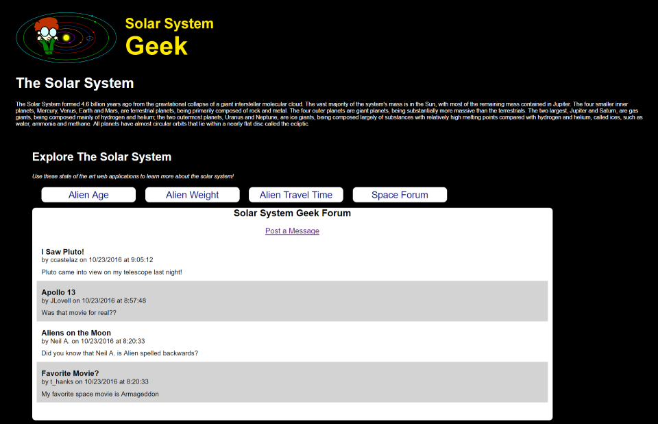
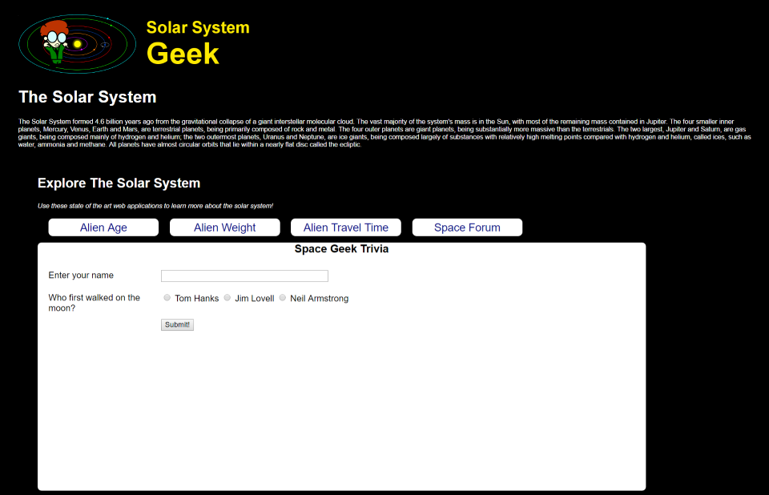
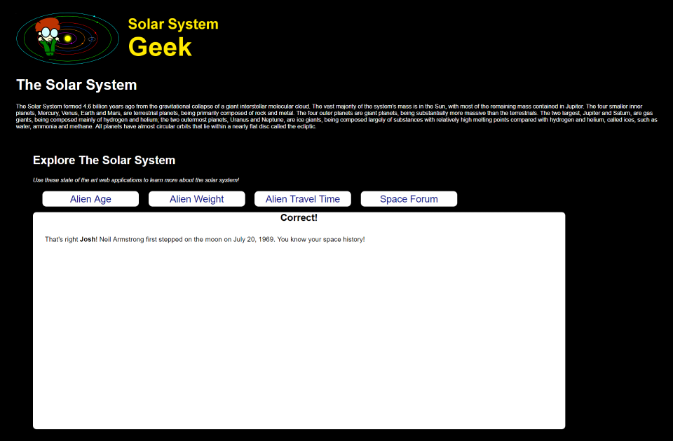

# MVC Controllers - Pair Exercise

# Day 2 - Tuesday - Solar System Geek Online Forum

You are developing an online bulletin board web component to SSGeek. Its a general forum posting, so anyone is welcome to join and post without needing to first login.

The application needs to support 2 core functionalities.
1. Provide a page that allows a site user to submit a new post to the bulletin board
2. View all posts on the bulletin board

**Your implementation must apply dependency injection and leverage a Test Double to ensure the controller logic is correct.**

**A database script, an interface, and a data access object has been provided. You will need to implement the details.**

## Submitting a New Post

Users can navigate to a page on the web application that provides them with a form to submit a new post for a bulletin board.

The page will provide the user with the form to submit:
* Username (required)
* Subject  (required)
* Message  (required)

## Viewing a Post

The View Posts page allows users the ability to see any posts that were previously submitted to the web application.

The page should display to the user all of the prior posts. You can use any type of layout that you prefer. 

Any new posts that are submitted from the Submit Post page should show up on the View a Post page.

---

# Day 2 Bonus

Create a form that allows website visitors to sign up to win a prize.

Each visitor needs to provide their name, and answer a space trivia question.

Leverage HTTP POST and the Post-Redirect-Get pattern to
1. Show the user the form
2. Have the user post their answer
3. Redirect the user to the correct action based on the input

When the user answers it correctly, they see a Correct! page that confirms their answer.

When the user answers incorrectly, they see an Incorrect! page telling them that they are incorrect.

---
