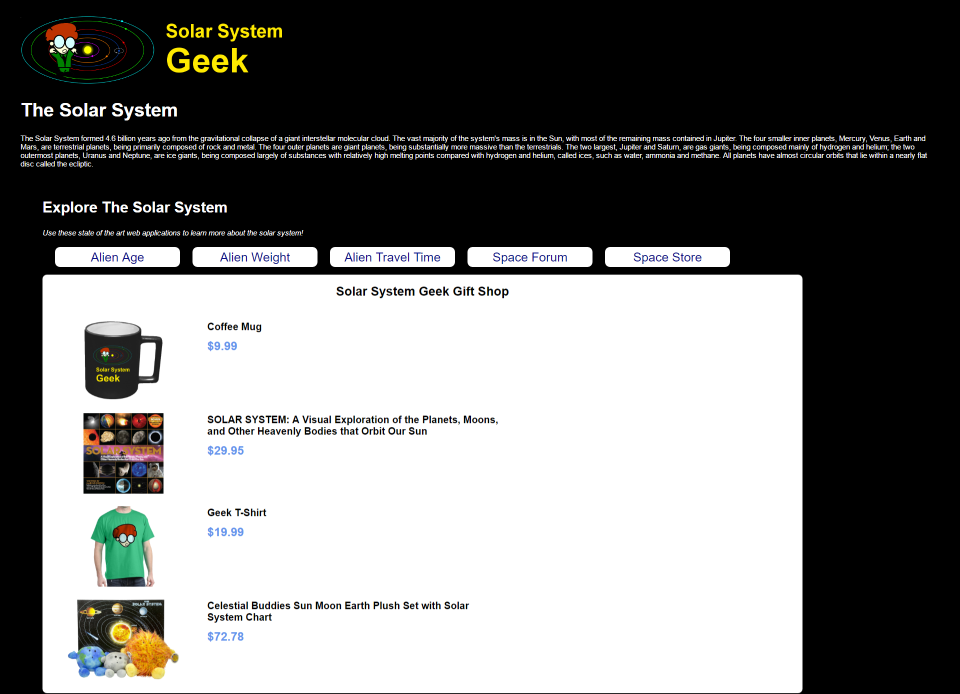
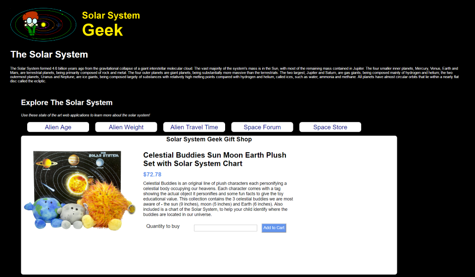
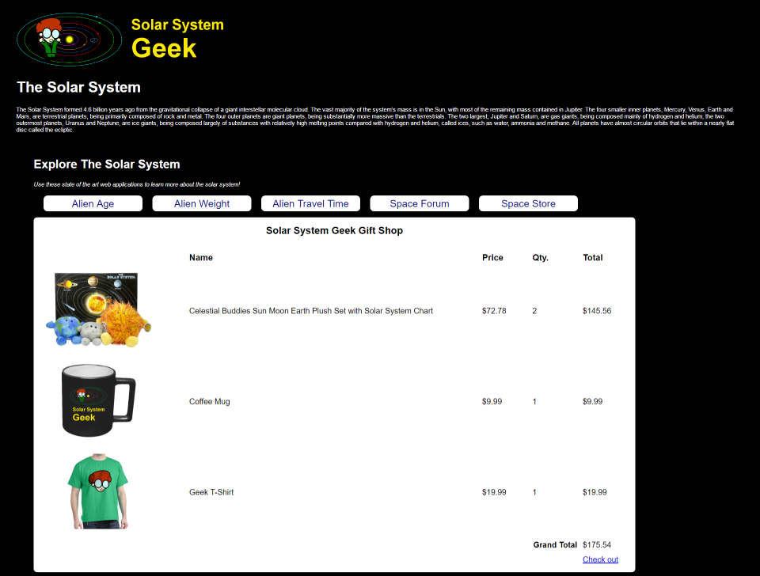

# MVC Controllers - Pair Exercise

# Day 3 - Wednesday - Shopping Cart

You'll be creating a shopping cart that allows your website visitor the ability to view products, select a product and add a user-specified quantity to the shopping cart.

## Product List Page

The product listing page displays all of the inventory that the SSGeek shop contains.

**Requirements**

- When the user clicks on the image of a product they are navigated to the **Product Detail** page

## Product Detail Page

The product detail page displays the data for a specific product and allows users to add products to their shopping cart.

**Requirements**

- When the user enters a quantity into the textbox and *presses Enter* or *presses Add to Cart* the product is added to their shopping cart
- After the user adds an item to their shopping cart, they are redirected to the View Cart page

## View Shopping Cart

The View Shopping Cart page displays all of the items that are in the visitor's shopping cart to purchase.

**Requirements**

